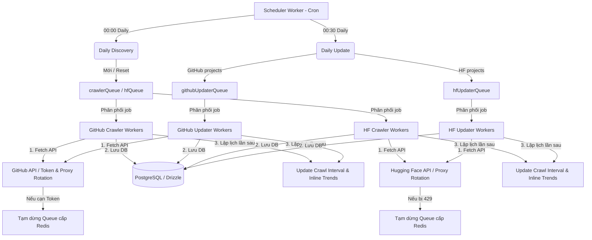

# Kiến trúc & Cơ chế Hệ thống Thu thập Dữ liệu (TiniX Crawler)

Tài liệu này mô tả chi tiết kiến trúc, các thành phần chính và cơ chế vận hành của hệ thống thu thập dữ liệu tự động (Crawler) trong dự án **TiniX Repo Trending**. Hệ thống được thiết kế để theo dõi, phát hiện và cập nhật liên tục các chỉ số của các dự án AI/ML nổi bật từ hai nguồn chính là **GitHub** và **Hugging Face**.

---

## 1. Sơ đồ Kiến trúc Tổng quan (System Architecture)

Hệ thống hoạt động theo mô hình **Producer-Consumer** phân tán, sử dụng **BullMQ** làm hàng đợi công việc, **Redis** làm bộ lưu trữ trạng thái hàng đợi/checkpoint/stats và **PostgreSQL** làm cơ sở dữ liệu lưu trữ chính.



---

## 2. Các Hàng đợi & Workers (Queue & Workers Layout)

Hệ thống quản lý công việc thông qua 5 hàng đợi BullMQ được cấu hình trong `src/workers/queue.ts`:

### Nhóm Discovery (Phát hiện dự án mới)
1. **`github-crawler` (crawlerQueue)**:
   - Chịu trách nhiệm crawl thông tin chi tiết của các repo GitHub mới phát hiện hoặc các request thủ công.
   - **Cấu hình Job**: retry tối đa 8 lần (`attempts: 8`), cơ chế giãn cách lũy thừa (`backoff: exponential`, bắt đầu từ 30 giây). Giữ lại 200 job hoàn thành và 5000 job thất bại gần nhất.
2. **`hf-crawler` (hfQueue)**:
   - Chịu trách nhiệm crawl các Model và Dataset mới phát hiện từ Hugging Face.
   - **Cấu hình Job**: retry tối đa 8 lần, giãn cách lũy thừa bắt đầu từ 30 giây.

### Nhóm Updater (Cập nhật chỉ số định kỳ)
3. **`github-updater` (githubUpdaterQueue)**:
   - Chịu trách nhiệm cập nhật chỉ số hàng loạt cho các dự án GitHub đã có trong database. **Hoàn toàn cô lập** với `crawlerQueue` — việc pause/drain/rate-limit trên queue này không ảnh hưởng đến Discovery.
   - **Cấu hình Job**: Tương tự `crawlerQueue` (8 attempts, exponential backoff).
4. **`hf-updater` (hfUpdaterQueue)**:
   - Chịu trách nhiệm cập nhật chỉ số hàng loạt cho các dự án HuggingFace đã có. Cô lập hoàn toàn với `hfQueue`.
   - **Cấu hình Job**: Tương tự `hfQueue`.

### Hệ thống lập lịch
5. **`scheduler-queue` (schedulerQueue)**:
   - Đảm nhận việc điều phối và kích hoạt các cron job lập lịch chạy định kỳ. Không thực hiện tự động retry khi thất bại (`attempts: 1`).

> **Tại sao tách riêng Discovery và Updater?** Khi hệ thống chạy Daily Update cho 6000+ dự án, toàn bộ quota API sẽ bị chiếm bởi update jobs. Nếu dùng chung queue, việc pause queue do rate-limit sẽ chặn luôn cả discovery. Tách riêng cho phép:
> - Discovery tiếp tục phát hiện dự án mới ngay cả khi updater bị pause.
> - Admin có thể drain/pause/resume từng nhóm độc lập trên Dashboard.
> - Dễ dàng scale số instance updater worker riêng biệt.

---

## 3. Cơ chế Khám phá & Cập nhật Dự án (Discovery & Update Logic)

### 3.1. Quy trình Phát hiện Dự án Mới (Daily Discovery)
Chạy vào **00:00 hàng ngày** thông qua Scheduler:
- **GitHub**: Gọi Search API để quét các dự án AI/ML có lượt sao > 100 theo 4 từ khóa chủ chốt: `ai`, `machine-learning`, `llm`, `deep-learning` (xem `src/lib/crawlers/github-discovery.ts`).
  - **Redis Checkpoint**: Quá trình quét lưu vết `topicIndex` và `page` hiện tại vào khóa `crawler:checkpoint:github-discovery` trên Redis. Nếu tiến trình bị gián đoạn (crash hoặc tắt máy), hệ thống sẽ tự động khôi phục và chạy tiếp từ vị trí cũ để tiết kiệm giới hạn API request.
  - **Trì hoãn an toàn**: Nghỉ 2.5 giây giữa các trang kết quả để tôn trọng giới hạn 30 requests/phút của GitHub Search API.
- **Hugging Face**: Quét top 100 Models và top 100 Datasets có xu hướng nổi bật dựa trên số lượt thích trong 7 ngày gần nhất (`sort=likes7d`) (xem `src/lib/crawlers/hf-discovery.ts`).
- **Logic xử lý**:
  - Nếu là dự án hoàn toàn mới: Thêm ngay vào hàng đợi crawl.
  - Nếu là dự án đã tồn tại nhưng lại lọt vào danh sách xu hướng (trending): Thiết lập lại khoảng thời gian thu thập về hàng ngày (`crawlInterval = 1`) và lên lịch crawl ngay lập tức.

### 3.2. Quy trình Cập nhật Định kỳ (Daily Update)
Chạy vào **00:30 hàng ngày**:
- Hệ thống truy vấn toàn bộ các dự án trong cơ sở dữ liệu có mốc thời gian crawl tiếp theo nhỏ hơn hoặc bằng hiện tại (`nextCrawlAt <= new Date()`).
- **Sắp xếp theo mức độ ưu tiên**: Các dự án được sắp xếp theo `crawlInterval ASC` (dự án hot trước) rồi `nextCrawlAt ASC` (dự án quá hạn lâu nhất trước).
- **BullMQ Priority**: Mỗi job được gán priority dựa trên `crawlInterval` — interval = 1 → priority 1 (cao nhất), interval = 30 → priority 10 (thấp nhất). Điều này đảm bảo dự án trending luôn được xử lý trước dù queue có nhiều job.
- Các dự án GitHub được gom nhóm và đẩy hàng loạt (`addBulk`) vào **`githubUpdaterQueue`** (thay vì `crawlerQueue`).
- Các dự án HuggingFace được gom nhóm và đẩy hàng loạt vào **`hfUpdaterQueue`** (thay vì `hfQueue`).
- Mỗi cụm (chunk) gồm 500 job để tránh làm nghẽn Redis.
- Cả hai updater queue sử dụng **cùng logic xử lý** (`handleGithubCrawlJob` / `handleHFCrawlJob`) nhưng chạy trên worker process riêng biệt.

---

## 4. Cơ chế Vượt giới hạn API & Xoay vòng (Token Rotation & Proxy Rotation)

Để thu thập dữ liệu với tần suất cao mà không bị chặn, Crawler tích hợp hai cơ chế xoay vòng thông minh:

### 4.1. GitHub Token Rotation (Xoay vòng Token)
Được quản lý bởi `GithubTokenPool` (xem `src/lib/crawlers/github-pool.ts`):
- Nạp danh sách các mã token cá nhân (PAT) từ biến môi trường `GITHUB_TOKENS` (ngăn cách bằng dấu phẩy).
- Phân phối yêu cầu theo thuật toán **Round-Robin** xoay vòng đều.
- **Theo dõi trạng thái cạn kiệt (Exhaustion)**: Khi nhận phản hồi 403 hoặc 429 từ GitHub API, hệ thống đọc header `x-ratelimit-reset` của token đó, đánh dấu token này bị khóa tạm thời và đồng bộ trạng thái khóa lên Redis bằng khóa `crawler:token:exhausted:${prefix_token}` kèm thời gian sống (TTL) tương ứng. Trạng thái này được chia sẻ chéo giữa các tiến trình worker khác nhau để tránh dùng lại token đang bị khóa.

### 4.2. Proxy Rotation (Xoay vòng Proxy IP)
Được quản lý bởi `ProxyManager` (xem `src/lib/crawlers/proxy.ts`):
- Nhận danh sách proxy từ biến môi trường `PROXY_URLS`.
- Chọn ngẫu nhiên một proxy cho mỗi request và sinh thực thể `ProxyAgent` từ thư viện `undici` để gán vào thuộc tính `dispatcher` của hàm `fetch` trong Node.js.
- Giúp phân tán địa chỉ IP khi gọi các request unauthenticated hoặc vượt qua các tường lửa giới hạn số lượng request từ một IP duy nhất.

### 4.3. Cơ chế Tạm dừng Hàng đợi Tự động khi Cạn kiệt Quota (Smart Rate-Limit Recovery)
Khi xảy ra tình huống toàn bộ GitHub token bị cạn kiệt hoặc Hugging Face phản hồi mã lỗi 429 (trong trường hợp không sử dụng Proxy):
1. **Tạm dừng cấp độ Redis**: Worker kích hoạt lệnh `queue.pause()` để tạm dừng toàn bộ hàng đợi trên Redis.
2. **Đồng bộ UI màu Cam**: Giao diện Admin Dashboard sẽ nhận biết trạng thái `Paused: true` từ Redis và hiển thị nhãn hàng đợi màu cam trực quan thay vì báo lỗi đỏ.
3. **Log êm ái**: Hệ thống in ra thông điệp cảnh báo rõ ràng trên `stdout` (sử dụng `console.log`) thay vì in lỗi stack trace đỏ lòm trên `stderr`, tránh làm trôi màn hình giám sát.
4. **Bỏ qua bộ đếm Lỗi**: Các job bị tạm dừng do cạn quota API tạm thời sẽ không làm tăng bộ đếm thất bại lũy kế (`failed`) trên hệ thống, giúp số liệu thống kê chính xác hơn.
5. **Tự động Khôi phục (Resume)**: Worker tính toán thời gian reset của API, chạy một bộ hẹn giờ ngầm và tự động kích hoạt `queue.resume()` khi API quota được phục hồi.

---

## 5. Cơ chế Lập lịch Động & Tốc độ Tăng trưởng (Dynamic Scheduling)

Tần suất crawl các dự án không cố định mà được điều chỉnh động dựa trên **Tốc độ tăng trưởng** (Growth Velocity) của dự án đó, nhằm phân phối tối ưu tài nguyên API quota (xem `src/lib/crawlers/scheduler.ts`).

### 5.1. Thuật toán Lập lịch
Hệ thống lấy ra **2 snapshot gần nhất** của dự án để tính chênh lệch tăng trưởng trung bình hàng ngày (`dailyStarsRate` hoặc `dailyLikesRate`/`dailyDownloadsRate`):

$$\text{Tốc độ tăng trưởng hàng ngày} = \frac{\text{Giá trị snapshot mới} - \text{Giá trị snapshot cũ}}{\text{Số ngày chênh lệch giữa hai snapshot}}$$

Dựa trên tốc độ tăng trưởng này, khoảng thời gian crawl tiếp theo (`crawlInterval`) được chỉ định động:

| Nguồn | Chỉ số / Ngày | Khoảng cách Crawl (`crawlInterval`) | Phân loại |
| :--- | :--- | :---: | :--- |
| **GitHub** | $\ge 100$ Stars | 1 ngày | Tăng trưởng cực nhanh |
| | $\ge 50$ Stars | 2 ngày | Tăng trưởng nhanh |
| | $\ge 10$ Stars | 4 ngày | Tăng trưởng trung bình |
| | $> 0$ Stars | 7 ngày | Tăng trưởng chậm |
| | $\le 0$ Stars | Tăng dần: 7 $\rightarrow$ 14 $\rightarrow$ 30 ngày | Không tăng trưởng |
| **Hugging Face** | $\ge 50$ Likes hoặc $\ge 5000$ Downloads | 1 ngày | Tăng trưởng cực nhanh |
| | $\ge 20$ Likes hoặc $\ge 1000$ Downloads | 2 ngày | Tăng trưởng nhanh |
| | $\ge 5$ Likes hoặc $\ge 200$ Downloads | 4 ngày | Tăng trưởng trung bình |
| | $> 0$ Likes hoặc $> 0$ Downloads | 7 ngày | Tăng trưởng chậm |
| | $\le 0$ Likes & $\le 0$ Downloads | Tăng dần: 7 $\rightarrow$ 14 $\rightarrow$ 30 ngày | Không tăng trưởng |

Sau đó, hệ thống cập nhật `nextCrawlAt = Date.now() + crawlInterval * 24h` để dời lịch cập nhật tiếp theo. Những dự án ít hoặc không tăng trưởng sẽ ít bị crawl hơn, tiết kiệm quota cho những dự án đang hot.

### 5.2. Tính toán Xu hướng tức thời (Inline Trend Calculation)
Ngay sau khi một dự án được crawl thành công, worker sẽ kích hoạt hàm `calculateProjectTrendInline(projectId)` để cập nhật ngay tốc độ tăng trưởng ngày, tuần, tháng của dự án đó vào bảng `project_trends`, giúp bảng xếp hạng Leaderboard trên web cập nhật tức thời các số liệu thay vì phải chờ cron job chạy cuối ngày.

---

## 6. Triển khai và Vận hành (Deployment & Scaling)

### 6.1. Chạy trong Môi trường Phát triển (Local Dev)
Sử dụng script:
```bash
npm run dev
```
Lệnh này chạy tệp `dev.ts`, tự động khởi chạy song song:
- **Next.js** dev server (Turbopack)
- **GitHub Crawler Worker** (discovery)
- **HF Crawler Worker** (discovery)
- **Scheduler Worker** (cron jobs)
- **GitHub Updater Worker** (batch updates)
- **HF Updater Worker** (batch updates)

### 6.2. Chạy trong Môi trường Sản xuất (Production)
Sử dụng cấu hình quản lý tiến trình **PM2** thông qua tệp `ecosystem.config.js`:

| Process | Instances | Vai trò |
| :--- | :---: | :--- |
| `tinix-web` | 1 | Next.js web app |
| `tinix-scheduler` | 1 | Cron job scheduler |
| `tinix-github-worker` | 3 | GitHub discovery crawler |
| `tinix-hf-worker` | 2 | HuggingFace discovery crawler |
| `tinix-github-updater` | 2 | GitHub batch updater |
| `tinix-hf-updater` | 1 | HuggingFace batch updater |

> **Cơ chế Cân bằng Tải Tự động**: Mỗi instance Worker được thiết lập concurrency là **5**. Khi chạy nhiều instances song song, BullMQ tự động phân phối các job từ hàng đợi Redis đến các worker đang rảnh rỗi. Updater workers chia sẻ cùng code xử lý với crawler workers nhưng tiêu thụ từ queue riêng biệt, đảm bảo không tranh chấp tài nguyên.
